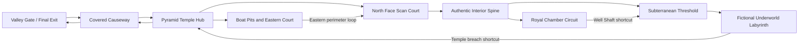

# Khufu Mega-Labyrinth Map Research and V5 Design Contract

Date: 2026-07-10
Status: Research complete; implementation not started
Project: `D:\AI2_WIN\channel_play`
NotebookLM notebook: https://notebooklm.google.com/notebook/871c7f05-a71d-4b29-85b2-7e398be93ccc
User concept image: `D:\Temp\User\codex-clipboard-d8678333-d02a-4e9e-bade-d86c4eb36f5a.png`

## Executive Decision

The concept image is useful game-level inspiration, but it is not an archaeological plan of
Khufu's Great Pyramid. Its hundreds of rooms, repeated terraces, and full-volume maze conflict
with the pyramid's dense limestone core.

The recommended map is therefore a layered hybrid:

1. Preserve `Pyramid Reference-matched V4` as the compact, evidence-based pyramid core.
2. Expand the playable world through Khufu's wider pyramid complex: causeway, pyramid temple,
   boat pits, eastern court, and necropolis context.
3. Treat the ScanPyramids North Face Corridor and Big Void as detected but unexplained evidence.
   They may be observed or represented by scans, but they are not traversable gameplay rooms.
4. Put the large maze in an explicitly fictional bedrock/underworld layer reached after the
   confirmed Subterranean Chamber threshold.
5. Build authored loops around landmarks instead of a random rectangular maze.

This gives the requested large pyramid labyrinth without turning speculation into fake history.

## Research Method

The research pass used the following query groups:

- `Khufu interior architecture chambers passages Grand Gallery`
- `ScanPyramids Big Void North Face Corridor muon 2025 2026`
- `Khufu pyramid complex causeway temple boat pits queens pyramids`
- `large vertical labyrinth level design loops landmarks wayfinding`
- `8 player hidden traitor map sightlines audio isolation`

NotebookLM deep research was used for source discovery and synthesis. Its first discovery set
contained sensational secondary reporting, so those claims were not accepted directly. The
final evidence baseline was restricted to peer-reviewed papers and institutional sources from
Nature, Scientific Reports, the Egyptian Ministry of Tourism and Antiquities, Harvard Digital
Giza, AERA, UNESCO, and selected professional level-design sources.

NotebookLM output is a synthesis aid, not an authority. Where a synthesis conflicts with a
primary source, the primary source controls this contract.

## Evidence Tiers

### Tier A: Confirmed and Mapped

- Khufu's pyramid is a dense masonry structure, not a hollow shell.
- Its original dimensions were approximately 230 m per side and 146.5 m high.
- Three primary chambers are known: King's Chamber, Queen's Chamber, and the bedrock-cut
  Subterranean Chamber.
- Known circulation includes the Descending Passage, Ascending Passage, horizontal branch,
  Grand Gallery, antechamber, and Well Shaft. The Well Shaft exists, but claims about its exact
  original purpose remain interpretive.
- The King's Chamber has a five-level relieving system above it.
- The broader royal complex included a pyramid/mortuary temple, a long covered causeway, a
  valley-temple relationship, boat pits, and nearby subsidiary/queen pyramids and cemeteries.
- Five Khufu boat pits are catalogued around the south and east sides of the pyramid and near
  the causeway.

### Tier B: Detected, High Confidence, Purpose Unknown

- **ScanPyramids Big Void (SP-BV):** above the Grand Gallery, minimum length about 30 m, detected
  independently with three muon technologies. Its exact shape, subdivision, access, and purpose
  remain unknown.
- **ScanPyramids North Face Corridor (SP-NFC):** behind the north-face Chevron, approximately
  9.06 m long with a cross-section near 2.02 m by 2.18 m. Muography, endoscopy, GPR, ultrasonic
  testing, and ERT support its existence and location.
- Current measurements do not support a normal human-sized connection from SP-NFC to SP-BV.
  A sub-meter connection cannot be fully excluded, but it is not a gameplay corridor.

### Tier C: Reconstruction or Hypothesis

- The architectural purpose of SP-BV and SP-NFC.
- The original function of several Grand Gallery slots and niches.
- Exact appearance and interior plan of Khufu's valley temple, which is not sufficiently known
  for a literal reconstruction.
- Exact ritual use, construction sequence, and access logic for several known spaces.
- Any claim that isolated voids form a larger connected network.

### Tier D: Explicit Game Fiction

- A large connected undercroft beneath the pyramid complex.
- Hundreds of rooms occupying most of the pyramid body.
- Human-sized travel through the Queen's Chamber shafts.
- A physical route connecting SP-NFC to SP-BV.
- Underground boat caverns, geysers, or a hidden city.
- Djoser galleries or the Hawara labyrinth presented as parts of Khufu's pyramid.
- Cyan route lighting, a giant cutaway opening, and the V4 lower portal.

Tier D content is allowed only when the project and map metadata call it a gameplay/mythic
adaptation rather than a discovery or reconstruction.

## Concept Image Audit

### Keep as Design Inspiration

- Strong vertical stacking and the feeling of descending through older layers.
- A central ascent that remains visible from several districts.
- Large landmark chambers between denser connector networks.
- Multiple loops that return to a recognizable central monument.
- A top-down operator-map language that shows route relationships clearly.
- Alternation between tight corridors and large social/combat spaces.

### Reject as Archaeological Structure

- The almost completely hollow pyramid body.
- Repeated horizontal floors spanning the full core.
- Hundreds of interchangeable rooms and a regular lower-floor grid.
- Open terraces and chambers immediately behind the exterior casing.
- Generic ritual-room labels with no relationship to known Khufu architecture.
- A truncated/stepped silhouette presented as the true form of Khufu's pyramid.

### Main Visual Risk

If every connector uses the same stone, width, ceiling height, and lighting, the result will feel
large for the first minute and exhausting afterward. Complexity must come from meaningful route
choices, landmarks, and shortcuts, not from room count alone.

## V5 Map Concept: Khufu - The Sealed Circuit

### Player Promise

Eight participants enter a compressed version of Khufu's wider funerary complex, split across
surface, monument, and bedrock layers. Three objectives force teams into different districts,
while a hidden traitor exploits controlled blind spots and alternate routes. The authentic
pyramid interior is the central navigational spine; the largest maze is an openly mythic game
layer below it.

### District Graph

### District Contract

| District | Evidence status | Landmark | Primary loop | Traitor affordance |
| --- | --- | --- | --- | --- |
| Valley Gate | Relationship grounded; geometry adapted | River-facing gate silhouette | Spawn-to-causeway return loop | Final convergence exposes inconsistent stories |
| Covered Causeway | Grounded relationship; compressed | Alternating dark roof slots | Direct route plus exterior maintenance bypass | Audio reveals direction but not identity |
| Pyramid Temple Hub | Grounded materials; gameplay-expanded | Black basalt court and red granite columns | Central ring reconnecting every branch | Pillars create brief, readable blind spots |
| Boat Pits/Eastern Court | Grounded location; traversal adapted | Solar boat in a surface trench | Two-sided trench loop back to temple | Long lateral sightlines support framing and alibis |
| North Face Scan Court | Exterior grounded; scan display interpretive | Chevron and scan projection | Exterior perimeter loop | Scan interaction attracts temporary crowds |
| Authentic Interior Spine | Tier A geometry, gameplay clearance adjusted | Grand Gallery | Ascending route plus Well Shaft return | Narrow passages create tension but retain escape |
| Royal Chamber Circuit | Tier A rooms, access adapted | Granite King's Chamber | Antechamber/relieving-system loop | High-value objective creates witness disputes |
| Underworld Labyrinth | Tier D, explicitly fictional | Central bedrock monolith | Three authored loops plus two shortcuts | Multiple exits support deception without hard trapping |

The Subterranean Chamber is the truth boundary between the confirmed structure and the fictional
underworld. That transition must be visually unmistakable.

## Objective Flow

The three keys can be collected in any order so teams may split, regroup, or lie about progress.

1. **Sun Key:** Boat Pit Circuit. This sends one team into an exposed surface loop with long
   sightlines and a recognizable boat landmark.
2. **Crown Key:** Royal Chamber Circuit. This sends players through the authentic vertical spine
   and its strongest chokepoints.
3. **Earth Key:** Deep Underworld Loop. This provides the requested maze fantasy, but its fiction
   status is explicit in project metadata and art direction.
4. **Final extraction:** Return all three keys to the Pyramid Temple mission terminal, then cross
   the causeway back to the Valley Gate.

SP-BV and SP-NFC are not key rooms. A scan terminal may reveal their positions, provide lore, or
temporarily enhance the Location Scanner, but the player does not enter them.

## Scale and Travel Budget

The first V5 blockout should reuse the validated V4 pyramid scale instead of rebuilding the core:

- V4 pyramid: 56 m square base, 35.636 m high.
- Total playable footprint target: approximately 250 m east-west by 180 m north-south.
- Vertical range: approximately `Y=-34 m` to `Y=+36 m`.
- Compressed causeway: 75-85 m versus the archaeological relationship of about 825 m.
- Gameplay-expanded temple hub: approximately 26 m by 22 m. This is not a strict 1:4 replica;
  it is expanded for eight-player circulation and camera coverage.
- Boat-pit/eastern court circuit: approximately 60 m by 35 m.
- Fictional underworld: approximately 120 m by 100 m across three macro floor planes.
- Underworld content budget: 8 landmark/objective rooms, 14-18 connectors, 5-7 optional reward
  rooms, and no more than two generic connectors in sequence.

Current controller speeds are 4.5 m/s walking and 7.0 m/s sprinting. The target authored route
length for collecting all keys and reaching extraction is 700-900 m before detours:

| Route measure | Walk target | Sprint target |
| --- | ---: | ---: |
| Spawn to Temple Hub | 20-30 s | 13-20 s |
| Hub to any key | 45-75 s | 30-50 s |
| Any key back to a reconnecting hub | <= 90 s | <= 58 s |
| All-key critical route, no interactions | 2.6-3.3 min | 1.7-2.2 min |
| Expected objective run with search and social play | 18-26 min | Not applicable |

This fits the existing 35-minute pilot clock while preserving time for purchases, accusations,
wrong turns, and operator intervention.

## Navigation Rules

1. Use three macro layers only: surface, monument, and bedrock. The underworld may have local
   elevation changes, but it must still read as one macro layer on the operator map.
2. Every major district has one landmark visible from at least two decision points.
3. Every objective branch reconnects to the main graph without requiring a full backtrack.
4. No unrewarded dead end may cost more than 15 seconds to enter and leave.
5. No corridor longer than 30 m may remain visually unchanged.
6. Every district gets a distinct material and acoustic identity:
   - causeway: dim limestone and long directional echo;
   - temple: black basalt, red granite, bright exterior light;
   - pyramid core: warm limestone and tight dry echo;
   - royal circuit: red granite and low mechanical resonance;
   - underworld: rough bedrock, timber supports, dust, and muted low-frequency ambience.
7. Warm architectural light identifies confirmed routes. A restrained cyan scan language is
   reserved for modern detection displays, never ancient architecture.
8. The Location Scanner gives direction, not a complete shortest-path overlay, so navigation
   remains meaningful.

## Social-Deduction Rules

- The Temple Hub is the primary meeting space and must permit eight-player circulation without
  body blocking.
- Mission rooms should normally have two exits. Single-exit rooms are brief high-tension spaces,
  not elimination traps.
- One-way drops require a recovery/reconnection path within 20 seconds.
- Blind spots are short and learnable; no key may sit in a completely unobservable cul-de-sac.
- Floor materials provide truthful but incomplete audio evidence about a player's district.
- Adjacent loops should occasionally expose silhouettes across grilles, shafts, or courtyards,
  allowing witnesses without granting perfect information.
- Each key route includes one public interaction point and one private-risk segment.
- Shortcuts open from the far side and reduce repeat travel after a district is learned.

## Relationship to Existing Work

### Preserve

- `ChannelPlayPyramidReferenceMatchedV4Builder.cs`
- `PYRAMID_REFERENCE_MATCHED_V4_DESIGN.md`
- The V4 dense-core, cutaway, Grand Gallery, chambers, and below-grade visual contract.
- Existing `TraitorEscapeMvpSession` objectives, shop, three-key requirement, scanner, and operator
  controls.

### Supersede for the Khufu Map

`ChannelPlayPyramidMazeV2Builder.cs` is an Egyptian-architecture anthology that combines Djoser,
Khufu, and Hawara. It may remain as a legacy prototype, but it must not be presented as the
interior of Khufu's Great Pyramid. V5 should use new Khufu-specific district names and evidence
metadata.

### New Build Boundary

Create the V5 world around the existing V4 root. Do not mutate V4 until the surrounding graph and
traversal tests pass. Keep district roots independent so they can be hidden, culled, rebuilt, and
validated separately.

## Implementation Phases

### Phase 0: Evidence and Coordinate Lock

- Freeze this district graph and evidence tier for every zone.
- Choose world origin, district bounds, spawn, keys, shop, mission terminal, and final exit.
- Produce a top-down and side-elevation blockout diagram before adding art.

### Phase 1: Authored Graybox

- Keep V4 in place.
- Build causeway, temple hub, boat circuit, north court, and underworld with primitives already
  used by the project.
- Build loops and shortcuts first; avoid adding a new package merely for grayboxing.
- Validate CharacterController clearance, slopes, drops, stairs, and reconnect times.

### Phase 2: Gameplay Integration

- Move the existing three keys to the Sun, Crown, and Earth circuits.
- Relocate the shop and mission terminal to the Temple Hub.
- Relocate final extraction to the Valley Gate.
- Make the Location Scanner district-aware.
- Extend operator camera bounds and district labels.

### Phase 3: Automated and Human Traversal

- Add a scripted route: spawn -> three keys -> mission terminal -> final exit.
- Test every loop in both directions and every shortcut from its intended unlock side.
- Record route lengths, traversal time, collision failures, and unreachable surfaces.
- Run at least one eight-roster/operator rehearsal even before real networking exists.

### Phase 4: Art and Evidence Language

- Apply district-specific materials and acoustics after graybox acceptance.
- Keep scan cyan limited to the North Face observation content.
- Mark the transition to the fictional underworld through architecture, lighting, and metadata.
- Preserve the pyramid's dense-core read in every exterior or cutaway camera.

### Phase 5: Performance and Proof

- Split static geometry and lights by district root.
- Use the pyramid mass and bedrock walls as natural occluders.
- Validate operator and player cameras at desktop target resolution.
- Capture top-down map, side elevation, player traversal, and final extraction evidence.
- Run Unity compilation, Play Mode smoke, route validation, and screenshot inspection.

## Acceptance Criteria

1. The complete map feels substantially larger than V4 while V4 remains a dense pyramid core.
2. The authored graph contains at least six major loops and three reconnecting shortcuts.
3. All three keys and the final exit are reachable with the current controller.
4. The uninterrupted all-key route is within the 700-900 m target.
5. No player must enter SP-BV, SP-NFC, or a Queen's Chamber shaft.
6. Djoser and Hawara labels do not appear in the Khufu V5 runtime hierarchy or UI.
7. Every district has a unique landmark, material identity, and acoustic identity.
8. The operator camera can identify all macro districts and follow the full objective route.
9. Unity compiles with zero errors and the automated traversal reaches extraction.
10. Final evidence separately states what is complete, incomplete, and not archaeologically
    verified.

## Primary Archaeology Sources

- Nature, 2017, Big Void: https://www.nature.com/articles/nature24647
- Nature Communications, 2023, North Face Corridor:
  https://www.nature.com/articles/s41467-023-36351-0
- Scientific Reports, 2025, multimodal North Face Corridor confirmation:
  https://www.nature.com/articles/s41598-025-91115-8
- Scientific Reports, 2025, ERT investigation:
  https://www.nature.com/articles/s41598-025-29081-4
- Egyptian Ministry, Great Pyramid:
  https://egymonuments.gov.eg/en/monuments/the-great-pyramid/
- Harvard Digital Giza, royal pyramid complexes:
  https://giza.fas.harvard.edu/lessons/royal-pyramid-complexes/
- Harvard Digital Giza, Khufu boat pits:
  https://giza.fas.harvard.edu/sites/1779/full/
- AERA, Khufu complex and approximately 825 m causeway:
  https://aeraweb.org/wp-content/uploads/2022/12/aeragram21_1-2.pdf
- AERA, Great Pyramid Temple: https://aeraweb.org/projects/great-pyramid-temple/
- Harvard/Digital Giza, Grand Gallery study:
  https://gizamedia.rc.fas.harvard.edu/documents/miatello_pjaee_7-6_2010.pdf

## Level-Design Sources

- Linear Labyrinth: https://www.gamedeveloper.com/design/level-design-the-linear-labyrinth
- Navigation and landmarks: https://www.gamedeveloper.com/design/no-more-wrong-turns
- GDC Level Design Workshop loops:
  https://www.gamedeveloper.com/design/gdc-2018-level-design-workshop-an-expert-roundtable-q-a
- Procedural Level Design in Eldritch:
  https://media.gdcvault.com/gdc2015/presentations/Pittman_David_Procedural%20Level%20Design.pdf
- Zelda dungeon structure:
  https://www.gamedeveloper.com/design/depicting-the-level-design-of-a-legend-of-zelda-dungeon
- Dishonored vertical and multi-route design:
  https://www.gamedeveloper.com/design/postmortem-the-level-design-of-dishonored-series
